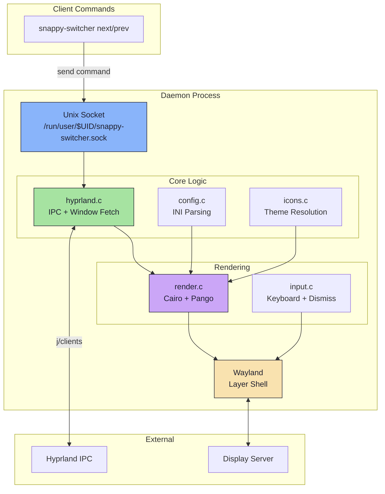

<div align="center">

# ⚡ Snappy Switcher

### A blazing-fast, context-aware ~~Alt+Tab~~ window switcher for Hyprland 

[](LICENSE)
[](https://en.cppreference.com/w/c)
[](https://hyprland.org/)
[]()
[](https://aur.archlinux.org/packages/snappy-switcher)

<br/>


<br/>

  *The window switcher that actually understands your workflow*
     
 *Pure C · Wayland Layer Shell · Zero dependencies on Electron or GTK runtimes*

</div>

---

## Key Features

| Feature | Description |
|---------|-------------|
| **Context Grouping** | Tiled windows sharing the same workspace + app class are collapsed into a single card with a count badge. Floating windows are never grouped. |
| **Dynamic Pango UI** | Cairo/Pango rendering pipeline with automatic grid scaling, HiDPI support, SVG/PNG icon resolution, and configurable workspace badges. |
| **Silent & Linear Routing** | `--silent` performs an instant MRU switch without ever creating a Wayland surface. `--linear` bypasses MRU for deterministic workspace/address cycling. Combinable. |
| **Dual-Track Dismiss** | Dismiss-on-release supports both XKB modifier masks (`alt`, `super`, `ctrl`, `shift`) and raw keycode tracking (`space`, `1`, `Return`, etc.). |
| **Rapid-Tap Safe** | The input engine distinguishes genuine config mismatches from rapid taps by inspecting the XKB depressed-modifier bitmask, eliminating false-alarm error banners. |
| **15 Themes** | Ships with Catppuccin (Mocha/Latte/Frappe), Dracula, Nord, Nordic, Tokyo Night, Gruvbox, Rose Pine, Cyberpunk, Liquid Glass, and more. Full `.ini` customization. |
| **Crash Recovery** | Socket takeover protocol ensures seamless daemon restart. `POLLHUP` detection prevents Wayland client death spirals if the compositor exits. |

---

## Installation

###  Arch Linux (AUR)

<table>
<tr>
<td>

**Using Yay**
```bash
yay -S snappy-switcher
```

</td>
<td>

**Using Paru**
```bash
paru -S snappy-switcher
```

</td>
</tr>
</table>

<details>
<summary><b>Build from PKGBUILD</b></summary>

```bash
git clone https://github.com/OpalAayan/snappy-switcher.git
cd snappy-switcher
makepkg -si
```

</details>

<details>
<summary><b>Fedora / RHEL</b></summary>

```bash
sudo dnf install wayland-devel cairo-devel pango-devel json-c-devel libxkbcommon-devel glib2-devel librsvg2-devel
```

> An RPM `.spec` file is included for building via `rpmbuild` or Copr.

</details>

###  Nix / NixOS

<table>
<tr>
<td>

**Install with Flakes**
```bash
nix profile install github:OpalAayan/snappy-switcher
```

</td>
<td>

**Run directly**
```bash
nix run github:OpalAayan/snappy-switcher
```

</td>
</tr>
</table>

<details>
<summary><b>Add to NixOS Configuration</b></summary>

```nix
# flake.nix
{
  inputs.snappy-switcher.url = "github:OpalAayan/snappy-switcher";
}

# configuration.nix
environment.systemPackages = [
  inputs.snappy-switcher.packages.${pkgs.system}.default
];
```

</details>

### Manual Build

<details>
<summary><b>Dependencies</b></summary>

| Package | Purpose |
|---------|---------|
| `wayland` | Core protocol |
| `cairo` | 2D rendering |
| `pango` | Text layout |
| `json-c` | IPC parsing |
| `libxkbcommon` | Keyboard handling |
| `glib2` | Utilities |
| `librsvg` | SVG icons *(optional)* |

</details>

```bash
# Arch
sudo pacman -S wayland cairo pango json-c libxkbcommon glib2 librsvg

# Build & install
make
sudo make install

# Or install for current user only
make install-user
```

---

## Quick Start

### 1. Setup Configuration

```bash
snappy-install-config
```

This copies themes to `~/.config/snappy-switcher/themes/` and creates `config.ini`.

### 2. Add to Hyprland Config

Add these to `~/.config/hypr/hyprland.lua`. The `--mod` flag **must** match the modifier used in the bind.

```lua
-- Start daemon on login
hl.exec_cmd("snappy-switcher --daemon")

-- Alt+Tab (standard MRU)
hl.bind("ALT + Tab", hl.dsp.exec_cmd("snappy-switcher next --mod alt"))

-- Super+Tab (workspace-filtered)
hl.bind("SUPER + TAB", hl.dsp.exec_cmd("snappy-switcher next --workspace --mod super"))
```

> **Hyprland v0.55+** uses Lua config (`hyprland.lua`), though it will work on older version of hyprland or using (`hyprland.conf`) on **v0.55.x**

### 3. Done

Press your configured bind to see it in action.

---

## Commands

| Command                    | Description                                                           |
| ----------------------------| -----------------------------------------------------------------------|
| `snappy-switcher --daemon` | Start the background daemon                                           |
| `snappy-switcher next`     | Cycle to next window                                                  |
| `snappy-switcher prev`     | Cycle to previous window                                              |
| `snappy-switcher toggle`   | Show/hide the switcher                                                |
| `snappy-switcher select`   | Activate the currently selected window                                |
| `snappy-switcher hide`     | Force-hide the overlay                                                |
| `snappy-switcher quit`     | Gracefully tear down Wayland surfaces, close the IPC socket, and exit |

> `--mod` `--workspace` `--silent` and `--linear` are flags and should be used with this commands
---

## Flags

Flags can be combined with `next`, `prev`, and `toggle`.

### `--mod <key>`

Tells the daemon which key to watch for release so it can dismiss the switcher.

| Type             | Values                                         | Tracking Method       |
| ------------------| ------------------------------------------------| -----------------------|
| **Modifiers**    | `alt`, `super`, `ctrl`, `shift`, `mod1`–`mod5` | XKB modifier mask     |
| **Regular keys** | `space`, `1`, `2`, `f`, `Return`, etc.         | Raw key press/release |

> Literally use it with **any fucking key** you want!!!, its a **WINDOW SWITCHER** not any *freaky* ~~ALT + TAB~~

**Rules:**
- The `--mod` value **must** match the key used in your compositor bind. A mismatch triggers a CONFIG ERROR banner.
- If `--mod` is omitted, the switcher opens in **toggle mode** -- no dismiss-on-release. Close with Escape, Enter, or `snappy-switcher toggle`.
- The engine handles rapid taps correctly: if you release the modifier before the compositor delivers the first event, it auto-dismisses instead of throwing a false error.

> just plz set bind 1st key and mod same key or you will be blessed with **scary** banners i made

### `--workspace`

Filter the window list to the currently active workspace.

### `--silent`

Perform an instant MRU switch without creating any Wayland UI. The Cairo rendering pipeline is bypassed entirely — the daemon queries the window list, picks the target, and calls `activate_window()` directly. If the GUI panel is already open, it is torn down before the silent switch executes.

### `--linear`

Use deterministic workspace/address sorting instead of MRU order. Windows are ordered by workspace ID first, then by Hyprland address. Combinable with `--silent` for headless deterministic cycling.

### Examples

```bash
# Standard Alt+Tab with GUI
snappy-switcher next --mod alt

# Workspace-filtered Super+Tab
snappy-switcher next --workspace --mod super

# Instant MRU switch, no UI
snappy-switcher next --silent

# Deterministic linear cycle, no UI
snappy-switcher next --silent --linear

# Space as dismiss key
snappy-switcher next --mod space

# Toggle mode (no modifier dismiss)
snappy-switcher toggle
```

---

## Theme Gallery

> All 15 themes included out of the box. Change one line in your config.

<table>
<tr>
<td align="center">
<br/>
<b>Snappy Slate</b><br/><sub>Default</sub>
</td>
<td align="center">
<br/>
<b>Catppuccin Mocha</b>
</td>
<td align="center">
<br/>
<b>Catppuccin Latte</b>
</td>
</tr>
<tr>
<td align="center">
<br/>
<b>Catppuccin Frappe</b>
</td>
<td align="center">
<br/>
<b>Tokyo Night</b>
</td>
<td align="center">
<br/>
<b>Nord</b>
</td>
</tr>
<tr>
<td align="center">
<br/>
<b>Nordic</b>
</td>
<td align="center">
<br/>
<b>Dracula</b>
</td>
<td align="center">
<br/>
<b>Gruvbox Dark</b>
</td>
</tr>
<tr>
<td align="center">
<br/>
<b>Rose Pine</b>
</td>
<td align="center">
<br/>
<b>Cyberpunk</b>
</td>
<td align="center">
<br/>
<b>Grovestorm</b>
</td>
</tr>
<tr>
<td align="center">
<br/>
<b>Stormlight</b>
</td>
<td align="center">
<br/>
<b>Liquid Glass White</b>
</td>
<td align="center">
<br/>
<b>Liquid Glass Black</b>
</td>
</tr>
</table>

### Change Theme

```ini
[theme]
name = catppuccin-mocha.ini
```
> If name doesnt match the file you made or left blank, it will switch to a **default** *ugly* theme

**[Full Configuration Documentation →](docs/CONFIGURATION.md)**

---

## Hyprland Integration

### Lua Config (v0.55+)

```lua
-- ── Snappy Switcher ──
hl.exec_cmd("snappy-switcher --daemon")

-- Alt+Tab: standard MRU switching
hl.bind("ALT + Tab", hl.dsp.exec_cmd("snappy-switcher next --mod alt"),
  { description = "Snappy Switcher" })

-- Super+Tab: workspace-filtered switching
hl.bind("SUPER + TAB", hl.dsp.exec_cmd("snappy-switcher next --workspace --mod super"),
  { description = "Snappy Switcher (Workspace)" })

-- Silent instant switch (no UI) + linear
-- hl.bind("CTRL + W", hl.dsp.exec_cmd("snappy-switcher next --silent --linear --mod ctrl"),
--   { description = "Snappy Silent Switch" })
```

> Could be mostly **Any key**!!


```toml
#try --silent alone to build mru and switch then break it with --linear (best for cli)
snappy-switcher next --silent
snappy-switcher next --silent --linear
```

>snappy-switcher next --linear will not work as intented if working with cli

```lua
-- Liquid Glass blur rules
 hl.layer_rule({ match = { namespace = "snappy-switcher" }, effect = "blur" })
 hl.layer_rule({ match = { namespace = "snappy-switcher" }, effect = "ignorealpha 0.01" })
```


### Config Error Banner

If the `--mod` value doesn't match the key physically held when the switcher gains focus, a red CONFIG ERROR banner is displayed. Dismiss it with Escape or Enter.

| Scenario                             | Result                             |
| --------------------------------------| ------------------------------------|
| Bind: `ALT+Tab`, Flag: `--mod alt`   | ✅ Normal operation                 |
| Bind: `ALT+Tab`, Flag: `--mod ctrl`  | ❌ CONFIG ERROR -- Ctrl is not held |
| `snappy-switcher next` from terminal | Toggle mode -- no error            |

---
### CLI MODE (No pop up or GUI)
With **test flags**
you can use Snappy-Switcher via shell or terminal
try ``--silent`` + ``--linear`` *combo*
---
## Architecture

<details>
<summary><b>Component Overview</b></summary>



</details>

### Key Components

| File | Purpose |
|------|---------|
| `main.c` | Daemon event loop, IPC command routing, silent/linear dispatch, `POLLHUP` orphan protection |
| `hyprland.c` | Hyprland IPC client, MRU + linear sorting, context aggregation |
| `render.c` | Cairo/Pango rendering, card drawing, workspace badges, error overlay |
| `config.c` | INI parser, theme loading, selected-state badge fallback |
| `icons.c` | XDG icon theme resolution, SVG/PNG loading, Flatpak discovery |
| `input.c` | Dual-track dismiss system (XKB modifier + raw keycode), Wayland state priming |
| `socket.c` | Unix domain socket IPC server/client |

**[Full Architecture Documentation →](docs/ARCHITECTURE.md)**

---

## 🛠️ Debugging & Development

### Debug Script

The project includes a unified debug/profiler tool at `./scripts/snappy-debug.sh`:

| Mode | Command | Description |
|------|---------|-------------|
| **Memcheck** | `./scripts/snappy-debug.sh --memcheck` | Launch daemon under Valgrind with `--leak-check=full --track-origins=yes`. Logs to `logs/valgrind-<timestamp>.log`. |
| **Trace** | `./scripts/snappy-debug.sh --trace` | Launch daemon under `strace` tracing network/file/poll syscalls. Logs to `logs/strace-<timestamp>.log`. |
| **Hammer** | `./scripts/snappy-debug.sh --hammer` | Stress test: fire 500 rapid `next --silent --linear` IPC commands while sampling CPU% and RSS every 200ms. Outputs a CSV profile to `logs/`. |

```bash
# Hammer with custom count
./scripts/snappy-debug.sh --hammer --count 1000

# Memcheck with custom config
./scripts/snappy-debug.sh --memcheck -c ./my-config.ini
```

### Contributing

```bash
git clone https://github.com/OpalAayan/snappy-switcher.git
cd snappy-switcher
make
```
> better do `sudo make install` enjoy it!!

---

## Credits & Inspiration

| Project                                             | Contribution                                                      |
| -----------------------------------------------------| -------------------------------------------------------------------|
| **[hyprshell](https://github.com/H3rmt/hyprshell)** | ~~Massive inspiration~~ Shamelessly stolen for tbh **everything** |

---

<div align="center">

### Made with love by [OpalAayan](mailto:YougurtMyFace@proton.me)

[](https://github.com/OpalAayan/snappy-switcher)

## Star History

[](https://www.star-history.com/#OpalAayan/snappy-switcher&type=date&legend=top-left)

<p align="center"></p>

<sub>Licensed under GPL-3.0</sub>

</div>
