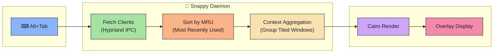
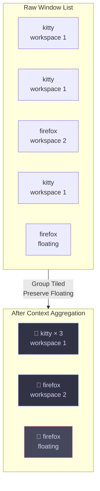
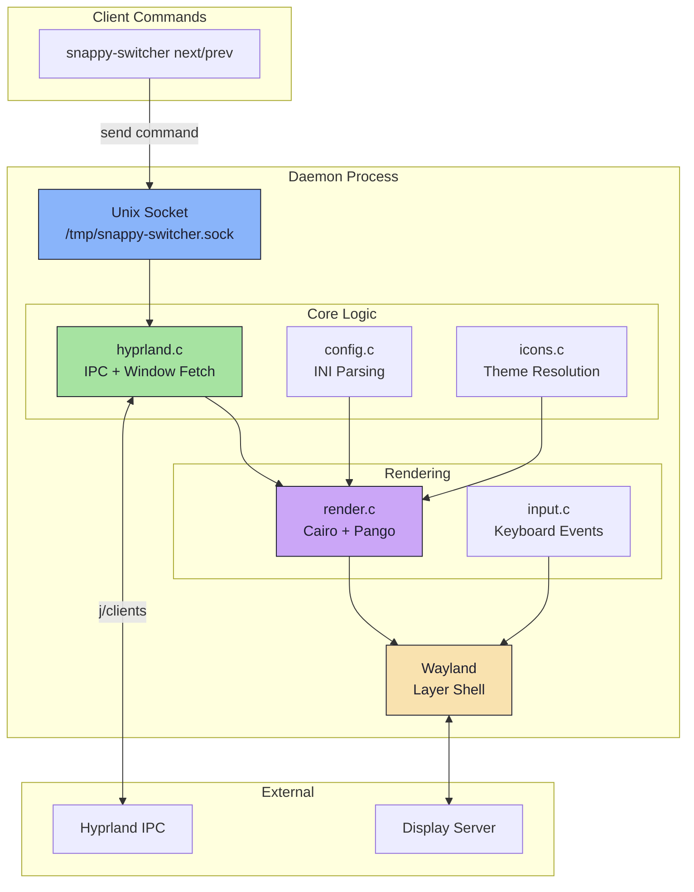

<div align="center">

# ⚡ Snappy Switcher

### A blazing-fast, animated Alt+Tab window switcher for Hyprland

[](LICENSE)
[](https://en.cppreference.com/w/c)
[](https://hyprland.org/)
[]()
[](https://aur.archlinux.org/packages/snappy-switcher)

<br/>


<br/>

*The window switcher that actually understands your workflow.*

</div>

---

## ✨ Why Snappy Switcher?

**Snappy Switcher** isn't just another window list—it's a **context-aware** window manager that thinks like you do:

| Feature | Description |
|---------|-------------|
|  **Context Grouping** | Automatically groups tiled windows by workspace + app class. Your 5 terminal windows become one clean card. |
|  **Sticky Mode** | Configurable active-window focus retention. Press Alt+Tab to open without immediately losing focus. |
|  **15 Themed Skins** | Ships with Catppuccin, Dracula, Nord, Liquid Glass, Tokyo Night, and more. Full `.ini` customization. |
|  **Native Performance** | Pure C with Wayland Layer Shell. No Electron. No lag. |
|  **Crash Recovery** | Socket takeover protocol ensures seamless recovery if the daemon restarts. |
|  **Polished Visuals** | Animated selection, drop shadows, rounded corners, and app badges—all Cairo-rendered. |
|  **SVG & Flatpak Support** | Native SVG icon rendering and automatic Flatpak icon discovery. |

---

##  How It Works



### 🔍 Context Mode in Action



> 💡 **Floating windows** are always shown individually~they're special!

---

## 📦 Installation

###  Arch Linux (AUR)

<table>
<tr>
<td>

**Using Yay**
```bash
yay -S snappy-switcher
```

</td>
<td>

**Using Paru**
```bash
paru -S snappy-switcher
```

</td>
</tr>
</table>

<details>
<summary>📦 <b>Build from PKGBUILD</b></summary>

```bash
git clone https://github.com/OpalAayan/snappy-switcher.git
cd snappy-switcher
makepkg -si
```

</details>

<details>
<summary>📦 <b>Other Linux Distributions (Fedora, etc.)</b></summary>

**Install dependencies (Fedora/RHEL):**
```bash
sudo dnf install wayland-devel cairo-devel pango-devel json-c-devel libxkbcommon-devel glib2-devel librsvg2-devel
```

> **Note:** RPM packages are available for Fedora/RHEL. See the included `snappy-switcher.spec` file for building via `rpmbuild` or Copr.

</details>

###  Nix / NixOS

<table>
<tr>
<td>

**Install with Flakes**
```bash
nix profile install github:OpalAayan/snappy-switcher
```

</td>
<td>

**Run directly**
```bash
nix run github:OpalAayan/snappy-switcher
```

</td>
</tr>
</table>

<details>
<summary>📦 <b>Add to NixOS Configuration</b></summary>

```nix
# flake.nix
{
  inputs.snappy-switcher.url = "github:OpalAayan/snappy-switcher";
}

# configuration.nix
environment.systemPackages = [
  inputs.snappy-switcher.packages.${pkgs.system}.default
];
```

</details>

### Manual Build

<details>
<summary>📋 <b>Dependencies</b></summary>

| Package | Purpose |
|---------|---------|
| `wayland` | Core protocol |
| `cairo` | 2D rendering |
| `pango` | Text layout |
| `json-c` | IPC parsing |
| `libxkbcommon` | Keyboard handling |
| `glib2` | Utilities |
| `librsvg` | SVG icons *(optional)* |

</details>

**Install dependencies (Arch):**
```bash
sudo pacman -S wayland cairo pango json-c libxkbcommon glib2 librsvg
```

```bash
# Build
make

# Install system-wide
sudo make install

# Or install for current user only
make install-user
```

---

## 🚀 Quick Start

### 1️⃣ Setup Configuration

```bash
snappy-install-config
```

This copies themes and creates `~/.config/snappy-switcher/config.ini`.

### 2️⃣ Add to Hyprland Config

Add these lines to `~/.config/hypr/hyprland.conf`:

```bash
# Start the daemon on login
exec-once = snappy-switcher --daemon

# Keybindings
bind = ALT, Tab, exec, snappy-switcher next
bind = ALT SHIFT, Tab, exec, snappy-switcher prev
```

### 3️⃣ You're Done! 🎉

Press <kbd>Alt</kbd> + <kbd>Tab</kbd> to see it in action.

---

## 🎨 Theme Gallery

> All 15 themes included out of the box. Just change one line in your config!

<table>
<tr>
<td align="center">
<br/>
<b>Snappy Slate</b><br/><sub>Default</sub>
</td>
<td align="center">
<br/>
<b>Catppuccin Mocha</b>
</td>
<td align="center">
<br/>
<b>Catppuccin Latte</b>
</td>
</tr>
<tr>
<td align="center">
<br/>
<b>Catppuccin Frappé</b><br/><sub>New in v3.0</sub>
</td>
<td align="center">
<br/>
<b>Tokyo Night</b>
</td>
<td align="center">
<br/>
<b>Nord</b>
</td>
</tr>
<tr>
<td align="center">
<br/>
<b>Nordic</b>
</td>
<td align="center">
<br/>
<b>Dracula</b>
</td>
<td align="center">
<br/>
<b>Gruvbox Dark</b>
</td>
</tr>
<tr>
<td align="center">
<br/>
<b>Rosé Pine</b>
</td>
<td align="center">
<br/>
<b>Cyberpunk</b>
</td>
<td align="center">
<br/>
<b>Grovestorm</b>
</td>
</tr>
<tr>
<td align="center">
<br/>
<b>Stormlight</b><br/><sub>New in v3.0</sub>
</td>
<td align="center">
<br/>
<b>Liquid Glass White</b><br/><sub>New in v3.0</sub>
</td>
<td align="center">
<br/>
<b>Liquid Glass Black</b><br/><sub>New in v3.0</sub>
</td>
</tr>
</table>

### 🎯 Change Theme

Edit `~/.config/snappy-switcher/config.ini`:

```ini
[theme]
name = catppuccin-mocha.ini
```

---

## ⚙️ Configuration

<details>
<summary>🔧 <b>Full Configuration Reference</b></summary>

```ini
# ~/.config/snappy-switcher/config.ini

[general]
# overview = Show all windows individually
# context  = Group tiled windows by workspace + app class
mode = context

[theme]
name = snappy-slate.ini
border_width = 2
corner_radius = 12

[layout]
card_width = 160
card_height = 140
card_gap = 10
padding = 20
max_cols = 5
icon_size = 56

[icons]
theme = Tela-dracula
fallback = hicolor
show_letter_fallback = true

[font]
family = Sans
weight = Bold
title_size = 10
```
<summary><b>My Conf</b></summary>

```ini

[general]
mode = context
follow_monitor = true
show_workspace_badge = true
dismiss_modifier = alt
sticky_mode = false
[theme]
name = stormlight.ini
border_width = 2
corner_radius = 15
[layout]
card_width = 145
card_height = 135
card_gap = 10
padding = 10
max_cols = 5
icon_size = 57
icon_radius = 15
[icons]
theme = Tela-dracula
fallback = Tela-dracula
show_letter_fallback = true
[font]
family = FiraCode Nerd Font
weight = Bold
title_size = 10
icon_letter_size = 24
```

</details>

📘 **[Full Configuration Documentation →](docs/CONFIGURATION.md)**

## Known Limitations
### ⚠️ Note on using `SUPER` as the dismiss modifier
If you set `dismiss_modifier = super`, native Arrow Key navigation (Left/Right/Up/Down) while the switcher is open may fail on certain compositors like Hyprland. 

**Why?** Hyprland aggressively routes `SUPER + Arrow` keystrokes to its own internal global keybindings (like `movefocus`), preventing Snappy Switcher from receiving the input. 

**Workarounds:**
1. Navigate using the trigger key (e.g., `Super + Tab` repeatedly).
2. Use `Super + Alt + Arrow Keys` to bypass the compositor's interception.
3. Keep the default `dismiss_modifier = alt`. 
*(PRs welcome from any Wayland protocol wizards who know how to force Hyprland to yield these keys!)*

---

## 🏗️ Architecture



### 📁 Key Components

| File | Purpose |
|------|---------|
| `main.c` | Daemon, event loop, socket server |
| `hyprland.c` | IPC client, window parsing, context aggregation |
| `render.c` | Cairo/Pango rendering, card drawing |
| `config.c` | INI parser, theme loading |
| `icons.c` | Icon theme resolution (XDG compliant) |
| `input.c` | Keyboard handling via libxkbcommon |
| `socket.c` | Unix socket IPC |

📘 **[Full Architecture Documentation →](docs/ARCHITECTURE.md)**

---

## 🧪 Available Commands

| Command | Description |
|---------|-------------|
| `snappy-switcher --daemon` | Start background daemon |
| `snappy-switcher next` | Cycle to next window |
| `snappy-switcher prev` | Cycle to previous window |
| `snappy-switcher toggle` | Show/hide switcher |
| `snappy-switcher hide` | Force hide overlay |
| `snappy-switcher select` | Confirm current selection |
| `snappy-switcher quit` | Stop the daemon |

---

## 🤝 Contributing

Contributions are welcome! Here's how to get started:

```bash
# Clone the repo
git clone https://github.com/OpalAayan/snappy-switcher.git
cd snappy-switcher

# Build
make

# Run tests
make test

# Clean build
make clean && make

# Run stress tests
./scripts/ultimate_stress_test.sh
```

---

##  Credits & Inspiration

This project was built with ❤️ for the Linux customization community.

| Project | Contribution |
|---------|--------------|
| **[hyprshell](https://github.com/H3rmt/hyprshell)** | Massive inspiration for client parsing and layer-shell handling |
| **[Hyprland](https://hyprland.org/)** | The incredible compositor that makes this possible |
| **[Catppuccin](https://github.com/catppuccin)** | Beautiful color palettes used in themes |

---

<div align="center">

### ⚡ Made with love by [OpalAayan](mailto:YougurtMyFace@proton.me)

[](https://github.com/OpalAayan/snappy-switcher)

## Star History

[](https://www.star-history.com/#OpalAayan/snappy-switcher&type=date&legend=top-left)


<p align="center"></p>

<sub>Licensed under GPL-3.0</sub>

</div>
