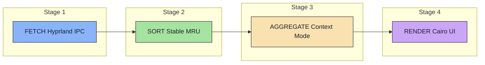
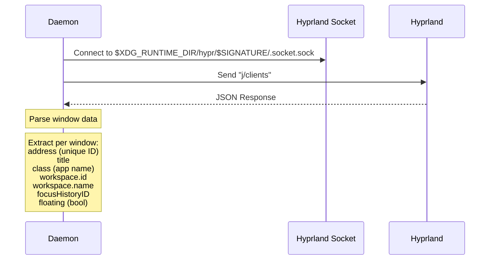
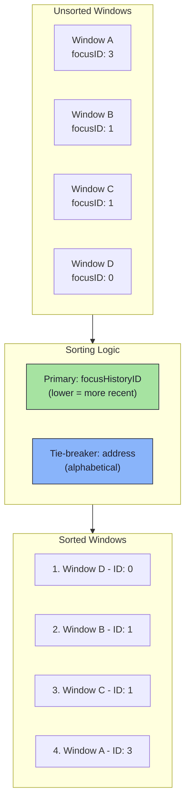
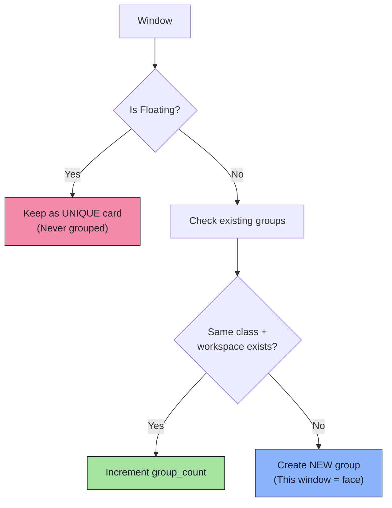
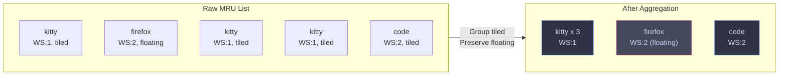
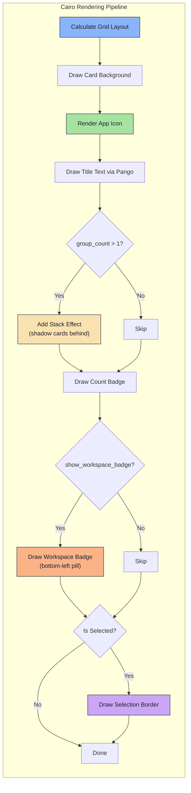
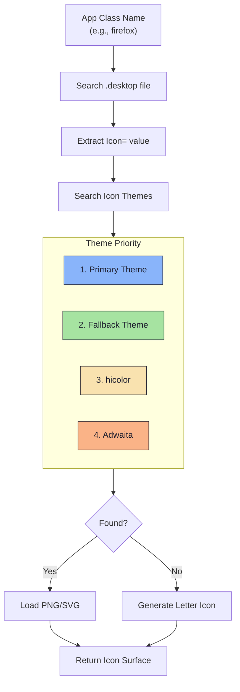
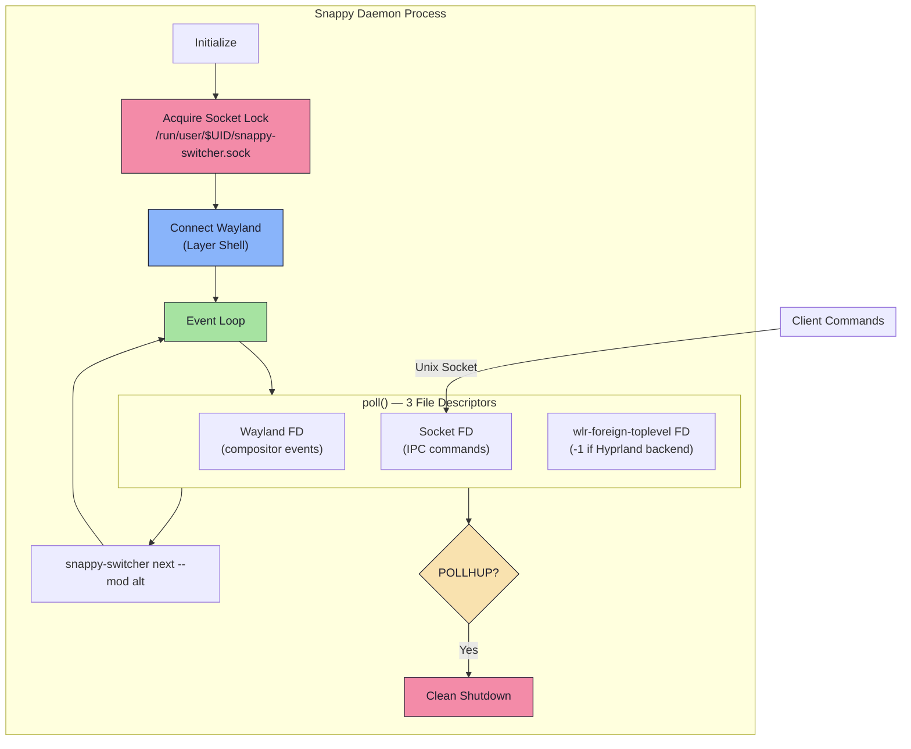
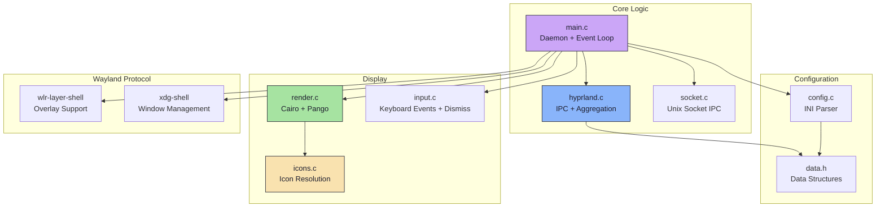

<div align="center">

# Snappy Switcher Architecture

*A deep dive into how Snappy Switcher processes and displays your windows*

</div>

---

## Overview

Snappy Switcher is a Wayland window switcher for Hyprland that supports two modes:

| Mode | Description |
|------|-------------|
| **Overview** | Shows all windows individually (like traditional Alt-Tab) |
| **Context** | Intelligently groups tiled windows by "Task" (Workspace + App Class) |

---

## Pipeline Architecture

The window handling follows a clear **4-stage pipeline**:



---

## Stage 1: Fetch (Hyprland IPC)

**File**: [`src/hyprland.c`](../src/hyprland.c) -- `parse_clients()`



**Extracted Fields:**

| Field | Type | Description |
|-------|------|-------------|
| `address` | `string` | Unique window identifier (hex) |
| `title` | `string` | Window title text |
| `class` | `string` | App class name (e.g., `kitty`, `firefox`) |
| `workspace.id` | `int` | Workspace number |
| `workspace.name` | `string` | Workspace name (e.g., `"1"`, `"music"`, `"special:scratchpad"`) |
| `focusHistoryID` | `int` | MRU position (0 = most recent) |
| `floating` | `bool` | Tiled or floating window |

---

## Stage 2: Sort (Stable MRU)

**File**: [`src/hyprland.c`](../src/hyprland.c) -- `compare_mru()`



**Sorting Algorithm:**

```c
int diff = wa->focus_history_id - wb->focus_history_id;
if (diff != 0) return diff;
return strcmp(wa->address, wb->address);  // Stable tie-breaker
```

---

## Stage 3: Aggregate (Context Mode)

**File**: [`src/hyprland.c`](../src/hyprland.c) -- `aggregate_context()`

> **Only runs when** `config->mode == MODE_CONTEXT`

### Aggregation Rules



### Visual Example



| Window Type | Behavior |
|-------------|----------|
| **Floating** | NEVER grouped -- always unique card |
| **Tiled** | Grouped by `workspace_id + class_name` |

---

## Stage 4: Render (Cairo UI)

**File**: [`src/render.c`](../src/render.c)



**Rendering Features:**

| Feature | Description |
|---------|-------------|
| **Grid Layout** | Dynamic columns up to `max_cols` |
| **Stack Effect** | Shadow cards behind grouped windows |
| **Count Badge** | Bottom-right circle badge for groups |
| **Workspace Badge** | Bottom-left pill showing workspace ID, named workspace letter, or `[S]` for special workspaces. Floating windows get an `F:` prefix. |
| **Selection Glow** | Highlighted border on selected card |
| **Error Overlay** | Red-bordered banner for config mismatch errors (see below). Size and font are configurable via `error_width`, `error_height`, `error_font_size`. |

---

## IPC Protocol

**Files**: [`src/main.c`](../src/main.c) -- `handle_command()`, `run_client()`

Client commands are sent over a Unix domain socket at `/run/user/$UID/snappy-switcher.sock`.

### Wire Format

```
CMD:MOD:WORKSPACE_FLAG:SOURCE:SILENT_FLAG:LINEAR_FLAG
```

| Field | Description | Examples |
|-------|-------------|---------|
| `CMD` | Command verb | `NEXT`, `PREV`, `TOGGLE`, `QUIT`, `HIDE`, `SELECT` |
| `MOD` | Dismiss key name | `ALT`, `SUPER`, `SPACE`, `1`, `none` |
| `WORKSPACE_FLAG` | Filter to current workspace | `0` (off), `1` (on) |
| `SOURCE` | Invocation origin | `cli` (terminal), `bind` (compositor keybind) |
| `SILENT_FLAG` | Bypass the Cairo UI entirely | `0` (off), `1` (on) |
| `LINEAR_FLAG` | Use deterministic sorting instead of MRU | `0` (off), `1` (on) |

### Source Detection

The `SOURCE` field lets the daemon distinguish between terminal invocations and compositor keybinds:

| Condition | Source | Behavior |
|-----------|--------|----------|
| `--mod` not given | `cli` | Toggle mode -- no dismiss-on-release |
| `--mod alt` given | `bind` | Modifier-tracking dismiss-on-release |

This prevents false error banners when a user types `snappy-switcher next` in a terminal without holding a modifier key.

### Command Routing

The daemon **always tokenizes first**, then routes. Bare commands like `QUIT` from the takeover protocol still work because tokenization produces `cmd_buf="QUIT"` with empty remaining fields.

---

## Dismiss System (Dual-Track)

**File**: [`src/input.c`](../src/input.c), [`src/input.h`](../src/input.h)

The dismiss system determines how the switcher closes after a selection. It supports two modes based on what the user passes to `--mod`:

### DismissType Enum

```c
typedef enum {
    DISMISS_TYPE_MODIFIER,  // Alt, Ctrl, Shift, Super -- tracked via XKB modifier mask
    DISMISS_TYPE_KEYCODE,   // Space, 1, f, Return -- tracked via key press/release events
} DismissType;
```

### Classification

When `input_set_dismiss_modifier()` receives a key name, it calls `classify_dismiss_key()`:

| Input | Classification | Tracking |
|-------|---------------|----------|
| `alt`, `mod1` | `DISMISS_TYPE_MODIFIER` | `xkb_state_mod_name_is_active()` |
| `super`, `mod4`, `logo` | `DISMISS_TYPE_MODIFIER` | `xkb_state_mod_name_is_active()` |
| `ctrl`, `shift` | `DISMISS_TYPE_MODIFIER` | `xkb_state_mod_name_is_active()` |
| `space` | `DISMISS_TYPE_KEYCODE` | `keyboard_key` press/release events |
| `1`, `2`, `f`, `Return` | `DISMISS_TYPE_KEYCODE` | `keyboard_key` press/release events |
| (unrecognized) | `DISMISS_TYPE_MODIFIER` | Falls back to Alt (Mod1) with a warning |

### Modifier Dismiss (DISMISS_TYPE_MODIFIER)

Tracked in `keyboard_modifiers()` via `xkb_state_mod_name_is_active()`. When the modifier is released, the callback `on_alt_release()` fires and the switcher closes.

### Keycode Dismiss (DISMISS_TYPE_KEYCODE)

Tracked in `keyboard_key()` via raw press/release events. The `keyboard_modifiers()` function returns early (after updating XKB state) when `dismiss_type == DISMISS_TYPE_KEYCODE` -- all dismiss logic is handled in `keyboard_key()` instead.

---

## Wayland State Priming (Race Condition Fix)

**File**: [`src/input.c`](../src/input.c) -- `keyboard_enter()`

### The Problem

When the switcher surface gains keyboard focus, Wayland delivers events in this order:

1. `keyboard_enter` -- with an array of currently pressed keycodes
2. `keyboard_modifiers` -- with the modifier mask

The race condition: some compositors send `keyboard_modifiers` with `depressed=0` on the first event, even though the user is physically holding a modifier key. Without mitigation, the daemon interprets this as "modifier not held" and triggers the error banner (B2 path).

### The Fix

`keyboard_enter()` now primes the XKB state by feeding held keycodes directly:

```c
wl_array_for_each(key, keys) {
    xkb_state_update_key(xkb_st, *key + 8, XKB_KEY_DOWN);
}
```

After priming, the function checks if the dismiss key/modifier is present and sets a flag:

- **DISMISS_TYPE_MODIFIER**: Sets `enter_primed_modifier = true` if the dismiss modifier is active in the primed state.
- **DISMISS_TYPE_KEYCODE**: Sets `mod_was_held = true` if the dismiss keysym is found in the pressed-keys array.

### Race Resolution in keyboard_modifiers

The `ignore_first_release` block now has three branches:

| Branch | Condition | Action |
|--------|-----------|--------|
| **A** | Modifier IS held (`any_held_now`) | Normal — wait for real release |
| **B (race fix)** | `enter_primed_modifier == true` | Trust keyboard_enter priming, wait for real release |
| **C1 (rapid tap)** | Neither held nor primed, `depressed == 0` | User released everything before the event arrived — auto-dismiss immediately via `on_alt_release()` |
| **C2 (config error)** | Neither held nor primed, `depressed != 0` | A *different* modifier is physically held (e.g. Super instead of Alt) — genuine config mismatch, show CONFIG ERROR banner |

The `depressed != 0` check is the key improvement: it uses the raw XKB depressed-modifier bitmask to distinguish a real mismatch (wrong key held) from a rapid tap (no keys held). This eliminates false-alarm error banners on fast Alt+Tab cycles.

The same logic applies in `keyboard_enter` for `DISMISS_TYPE_KEYCODE`: `xkb_state_serialize_mods(xkb_st, XKB_STATE_MODS_DEPRESSED)` is checked to distinguish between a modifier being held (config mismatch) vs. no modifiers at all (rapid tap → auto-dismiss).

---

## Error Overlay

**File**: [`src/render.c`](../src/render.c) -- `draw_error_overlay()`

When the daemon detects a configuration mismatch (the `--mod` key is not physically held), it renders a red-bordered error banner instead of the window grid.

### When it triggers

| Dismiss Type | Trigger |
|-------------|---------|
| `DISMISS_TYPE_MODIFIER` | `keyboard_modifiers` reports no dismiss modifier held AND `keyboard_enter` did not prime it |
| `DISMISS_TYPE_KEYCODE` | `keyboard_enter` keys array does not contain the dismiss keysym, but other keys ARE held (real keybind) |

The banner shows a two-line message:

```
CONFIG ERROR: Modifier not held.
Ensure --mod flag matches your keybind.
```

The user must press Escape or Enter to close. The switcher is "disarmed" -- releasing the actual held key will not dismiss.

### Configuration

The error overlay auto-sizes based on its content. Only the font size is configurable:

| Key | Default | Description |
|-----|---------|-------------|
| `error_font_size` | `13` | Error text font size (pt). Hint text auto-scales to ~70%. |

---

## Orphan Protection

**File**: [`src/main.c`](../src/main.c) — Event Loop

The daemon's `poll()` loop monitors three file descriptors:

| FD | Source | Purpose |
|----|--------|---------|
| `fds[0]` | `wl_display_get_fd(display)` | Main Wayland compositor connection |
| `fds[1]` | `socket_fd` | IPC server socket |
| `fds[2]` | `wlr_backend_get_fd()` | wlr-foreign-toplevel-management display (`-1` if Hyprland backend) |

If the compositor exits or crashes, the Wayland fd fires `POLLHUP`, `POLLERR`, or `POLLNVAL`. Without detection, this causes an infinite spin loop where `poll()` returns instantly every iteration. The daemon now catches these flags and shuts down cleanly:

```c
if (fds[0].revents & (POLLHUP | POLLERR | POLLNVAL)) {
    LOG("Fatal: Wayland compositor connection lost — shutting down");
    wl_display_cancel_read(display);
    break;
}
```

This prevents zombie daemon processes that consume CPU after the compositor is gone.

---

## Data Structures

### WindowInfo

**File**: [`src/data.h`](../src/data.h)

```c
typedef struct {
  char *address;        // Window address (hex)
  char *title;          // Window title
  char *class_name;     // App class name
  int workspace_id;     // Workspace number
  char *workspace_name; // Workspace name (e.g. "1", "music", "special:scratchpad")
  int focus_history_id; // MRU position
  bool is_active;       // Currently focused?
  bool is_floating;     // Floating or tiled?
  int group_count;      // Number of windows in group
} WindowInfo;
```

### Config

**File**: [`src/config.h`](../src/config.h)

```c
typedef enum { MODE_OVERVIEW, MODE_CONTEXT } ViewMode;

typedef struct {
  ViewMode mode;        // Overview or Context
  int max_cols;         // Grid column limit
  int error_width;      // Error banner width
  int error_height;     // Error banner height
  int error_font_size;  // Error text font size
  char icon_theme[64];  // Icon theme name
  // ... colors, dimensions
} Config;
```

---

## Icon Loading

**File**: [`src/icons.c`](../src/icons.c)



---

## Daemon Architecture

**File**: [`src/main.c`](../src/main.c)



### Available Commands

| Command | Description |
|---------|-------------|
| `next` | Cycle to next window. Supports `--mod <key>`, `--workspace`, `--silent`, and `--linear` flags. |
| `prev` | Cycle to previous window. Supports `--mod <key>`, `--workspace`, `--silent`, and `--linear` flags. |
| `toggle` | Show/hide switcher |
| `hide` | Force hide overlay |
| `select` | Confirm current selection |
| `quit` | Gracefully tear down Wayland surfaces, close IPC socket, and exit |

### Navigation & Initial Jump Logic

When the daemon receives a `next` or `prev` command while hidden, it opens the UI and calculates the initial starting index:
- By default (legacy behavior), the daemon skips index `0` (the active window) and hard-jumps to index `1` to facilitate rapid switching.
- If `sticky_mode` is enabled in the configuration, the daemon bypasses this jump and begins navigation strictly at index `0`. Post-open navigation mathematics (`(index + dir) % count`) naturally handle routing from either starting point.

---

## File Overview



---

<div align="center">

**[Back to README](../README.md)** -- **[Configuration Guide](CONFIGURATION.md)**

</div>
