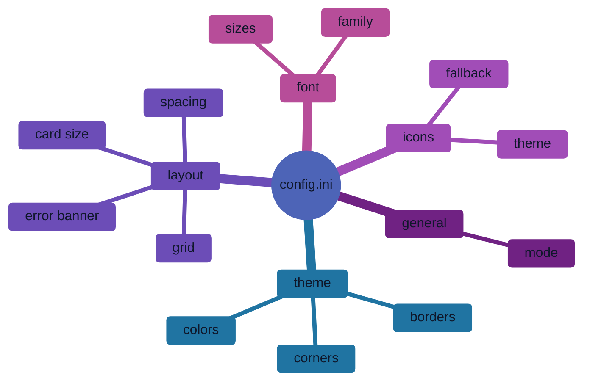
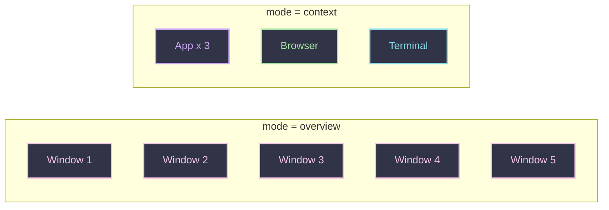
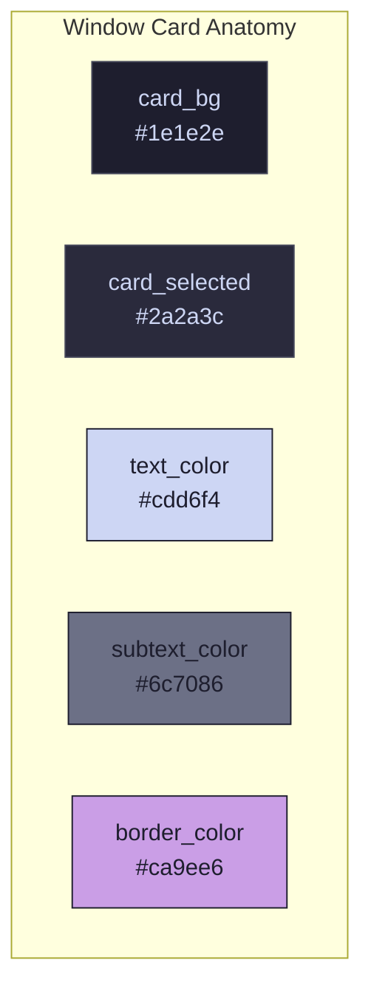
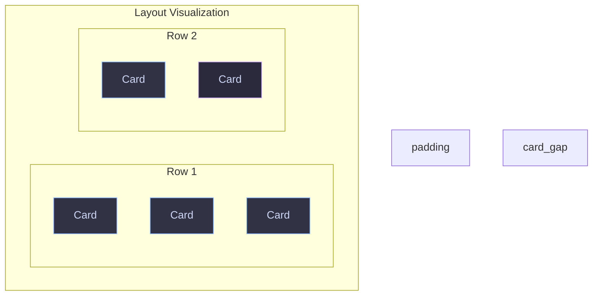
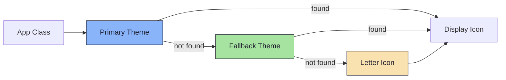

<div align="center">

# Snappy Switcher Configuration

*Customize every aspect of your window switcher*

</div>

---

## Configuration Location

```
~/.config/snappy-switcher/config.ini
```

> **Quick Setup:** Run `snappy-install-config` to create the config file and install themes automatically.

---

## Quick Start

```ini
[general]
mode = context

[theme]
name = catppuccin-mocha.ini

[icons]
theme = Papirus-Dark
fallback = hicolor
```

---

## Configuration Sections



---

## [general] -- Mode Settings

Control how windows are displayed and grouped.



| Key | Values | Default | Description |
|-----|--------|---------|-------------|
| `mode` | `overview`, `context` | `context` | Window grouping mode |
| `show_workspace_badge` | `true`, `false` | `true` | Show workspace indicator badge on each card |
| `follow_monitor` | `true`, `false` | `false` | Panel follows the focused monitor |
| `sticky_mode` | `true`, `false` | `false` | When true, opening the switcher retains focus on the currently active window instead of immediately jumping to the previous window. |

### Mode Comparison

| Mode | Behavior | Best For |
|------|----------|----------|
| **Overview** | Shows all windows individually | Simple workflows, few windows |
| **Context** | Groups tiled windows by workspace + app class | Power users, many windows |

```ini
[general]
mode = context  # Enable intelligent grouping
```

### Workspace Badge

When `show_workspace_badge = true` (the default), each card displays a small pill-shaped tag in its bottom-left corner that tells you **which workspace the window lives on** at a glance.

**How it works under the hood:**

The renderer inspects each window's `workspace_id` and `workspace_name` (pulled from Hyprland's IPC) and formats a short tag using these rules:

| Workspace Type | Tag Format | Example | When |
|----------------|------------|---------|------|
| **Numbered** (standard) | `[N]` | `[3]` | Workspace name is just a number |
| **Numbered + Floating** | `[F:N]` | `[F:3]` | Floating window on workspace 3 |
| **Named** (1st occurrence) | `[L]` | `[M]` | First named workspace starting with "M" |
| **Named** (2nd+ occurrence) | `[L:n]` | `[M:1]` | Second named workspace starting with "M" |
| **Named + Floating** | `[L:F]` | `[M:F]` | Floating window on a named workspace |
| **Special** | `[S]` | `[S]` | Hyprland special workspace (scratchpad, etc.) |
| **Special + Floating** | `[S:F]` | `[S:F]` | Floating window on a special workspace |

> The badge shows a compact label so you always know *where* a window belongs ~ a number for standard workspaces, a letter for named ones, and `S` for special/scratchpad workspaces. If the window is floating, it gets an extra `F:` prefix so you can tell it apart from tiled windows at a glance.

```ini
[general]
show_workspace_badge = true   # Toggle badge visibility
```

---

## [theme] -- Colors & Styling

All colors use hex format: `#RRGGBB` or `#RRGGBBAA` (with alpha transparency)



### Color Options

| Key | Default | Description |
|-----|---------|-------------|
| `name` | `snappy-slate.ini` | Theme file to load |
| `background` | `#1e1e2eff` | Main overlay background |
| `card_bg` | `#313244ff` | Card background color |
| `card_selected` | `#45475aff` | Selected card background |
| `border_color` | `#89b4faff` | Selection border (accent) |
| `text_color` | `#cdd6f4ff` | Primary text color |
| `subtext_color` | `#a6adc8ff` | Secondary/dimmed text |
| `bundle_bg` | `#313244ff` | Context-mode stacked card background |
| `badge_bg` | `#89b4faff` | Group count & workspace badge background (unselected) |
| `badge_text_color` | `#cdd6f4ff` | Badge text color (unselected) |
| `badge_bg_selected` | *(falls back to `badge_bg`)* | Badge background when the card is selected. Use a bolder or brighter variant of `badge_bg` for visual contrast. |
| `badge_text_color_selected` | *(falls back to `badge_text_color`)* | Badge text color when the card is selected. Should contrast with `badge_bg_selected`. |

> **Fallback behavior:** If `badge_bg_selected` or `badge_text_color_selected` are not set in the theme file, the renderer falls back to the standard `badge_bg` and `badge_text_color` values. This keeps older themes working without changes.

### Border & Corner Options

| Key | Default | Description |
|-----|---------|-------------|
| `border_width` | `2` | Border thickness (px) |
| `corner_radius` | `15` | Rounded corner radius (px) |

```ini
[theme]
name = catppuccin-mocha.ini

# Override specific colors (optional)
background = #11111bff
card_bg = #1e1e2eff
card_selected = #2a2a3cff
border_color = #ca9ee6ff
text_color = #cdd6f4ff
subtext_color = #6c7086ff
bundle_bg = #1e1e2eff
badge_bg = #9DC2F9ff
badge_text_color = #11111bff
badge_bg_selected = #c1e6ffff
badge_text_color_selected = #11111bff
border_width = 2
corner_radius = 15
```

### Available Themes

| Theme | File |
|-------|------|
| Snappy Slate (default) | `snappy-slate.ini` |
| Catppuccin Mocha | `catppuccin-mocha.ini` |
| Catppuccin Latte | `catppuccin-latte.ini` |
| Catppuccin Frappe | `catppuccin-frappe.ini` |
| Tokyo Night | `tokyo-night.ini` |
| Nord | `nord.ini` |
| Dracula | `dracula.ini` |
| Gruvbox Dark | `gruvbox-dark.ini` |
| Rose Pine | `rose-pine.ini` |
| Nordic | `nordic.ini` |
| Grovestorm | `grovestorm.ini` |
| Cyberpunk | `cyberpunk.ini` |
| Stormlight | `stormlight.ini` |
| Liquid Glass White | `liquid-glassW.ini` (needs blur) |
| Liquid Glass Black | `liquid-glassB.ini` (needs blur) |

---

## [layout] -- Dimensions & Spacing



### Card Dimensions

| Key | Default | Description |
|-----|---------|-------------|
| `card_width` | `160` | Card width in pixels |
| `card_height` | `140` | Card height in pixels |

### Spacing

| Key | Default | Description |
|-----|---------|-------------|
| `card_gap` | `10` | Gap between cards (px) |
| `padding` | `20` | Window padding (px) |

### Grid & Icons

| Key | Default | Description |
|-----|---------|-------------|
| `max_cols` | `5` | Maximum columns before wrap |
| `icon_size` | `56` | App icon size (px) |
| `icon_radius` | `12` | Icon corner radius (px) |

### Error Banner

The CONFIG ERROR overlay is rendered when the `--mod` flag does not match the key being held. The overlay now auto-sizes based on content — only the font size is configurable.

| Key | Default | Description |
|-----|---------|-------------|
| `error_font_size` | `13` | Error text font size (pt). Hint text auto-scales to ~70%. |

```ini
[layout]
card_width = 160
card_height = 140
card_gap = 10
padding = 20
max_cols = 5
icon_size = 56
icon_radius = 15
error_font_size = 13
```

---

## [icons] -- Icon Theme



| Key | Default | Description |
|-----|---------|-------------|
| `theme` | `Tela-dracula` | Primary icon theme |
| `fallback` | `Tela-circle-dracula` | Fallback theme |
| `show_letter_fallback` | `true` | Show letter if no icon found |

### Popular Icon Themes

| Theme | Style |
|-------|-------|
| `Papirus` | Flat, colorful |
| `Papirus-Dark` | Flat, dark variant |
| `Tela` | Modern, gradient |
| `Numix` | Flat, circle |
| `Adwaita` | GNOME default |
| `hicolor` | System fallback |

```ini
[icons]
theme = Papirus-Dark
fallback = hicolor
show_letter_fallback = true
```

---

## [font] -- Typography

| Key | Default | Description |
|-----|---------|-------------|
| `family` | `Sans` | Font family name |
| `weight` | `Bold` | Font weight |
| `title_size` | `10` | Title font size (px) |
| `icon_letter_size` | `24` | Fallback letter size (px) |

### Recommended Fonts

| Font | Style |
|------|-------|
| `Sans` | System default |
| `Inter` | Clean, modern |
| `Roboto` | Material Design |
| `JetBrainsMono Nerd Font` | Monospace + icons |
| `SF Pro Display` | macOS-like |

```ini
[font]
family = Inter
weight = Bold
title_size = 10
icon_letter_size = 24
```

---

## Hyprland Keybindings

Add these to `~/.config/hypr/hyprland.lua`. The `--mod` flag must match the key you are holding in the bind so the switcher knows when to dismiss. If they do not match, you will see a CONFIG ERROR banner.

```lua
-- Start daemon on login
hl.on("hyprland.start", function()
    hl.dispatch(hl.dsp.exec_cmd("snappy-switcher --daemon"))
end)

-- Alt-Tab (default)
hl.bind("ALT + Tab", hl.dsp.exec_cmd("snappy-switcher next --mod alt"))
hl.bind("ALT + SHIFT + Tab", hl.dsp.exec_cmd("snappy-switcher prev --mod alt"))

-- Super-Tab (Workspace Filtered)
-- hl.bind("SUPER + Tab", hl.dsp.exec_cmd("snappy-switcher next --workspace --mod super"))
-- hl.bind("SUPER + SHIFT + Tab", hl.dsp.exec_cmd("snappy-switcher prev --workspace --mod super"))
```

### Non-Modifier Keys as Dismiss

You can use any key as the dismiss trigger, not just modifiers. For example, to dismiss on Space release:

```lua
hl.bind("SPACE + Tab", hl.dsp.exec_cmd("snappy-switcher next --mod space"))
```

This uses keycode tracking instead of XKB modifier tracking. See [ARCHITECTURE.md](ARCHITECTURE.md) for details on the dual-track dismiss system.

**Important:** The `--mod` value must match the key in the bind. If you bind `ALT + Tab` but pass `--mod space`, the switcher will show a CONFIG ERROR banner because Space is not being held.

### Edge Cases

| Scenario | Behavior |
|----------|----------|
| `snappy-switcher next` (no `--mod`) | Opens in toggle mode. No dismiss-on-release. Close with Escape, Enter, or `toggle`. |
| `snappy-switcher next --mod alt` in a terminal (not holding Alt) | Toggle mode. No error banner because `SOURCE=cli`. |
| Bind is `ALT+Tab`, command has `--mod alt` | Normal dismiss-on-release. Closes when Alt is released. |
| Bind is `ALT+Tab`, command has `--mod ctrl` | CONFIG ERROR banner. Ctrl is not held. Disarmed -- press Escape or Enter to close. |
| Bind is `ALT+Tab`, command has `--mod space` | CONFIG ERROR banner. Space is not held. Disarmed -- press Escape or Enter to close. |
| Different binds with different flags | Works correctly. Each bind can use its own `--mod`. E.g., `ALT+Tab` with `--mod alt` and `SUPER+Tab` with `--mod super`. |

### Optional Keybindings

```lua
-- Toggle visibility
hl.bind("SUPER + Tab", hl.dsp.exec_cmd("snappy-switcher toggle"))

-- Quick hide
hl.bind("Escape", hl.dsp.exec_cmd("snappy-switcher hide"))
```

---

## Complete Example

<details>
<summary><b>Click to expand full config.ini</b></summary>

```ini
# ~/.config/snappy-switcher/config.ini

[general]
mode = context
show_workspace_badge = true

[theme]
name = catppuccin-mocha.ini
background = #11111bff
card_bg = #1e1e2eff
card_selected = #2a2a3cff
border_color = #ca9ee6ff
text_color = #cdd6f4ff
subtext_color = #6c7086ff
bundle_bg = #1e1e2eff
badge_bg = #9DC2F9ff
badge_text_color = #11111bff
badge_bg_selected = #c1e6ffff
badge_text_color_selected = #11111bff
border_width = 2
corner_radius = 15

[layout]
card_width = 160
card_height = 140
card_gap = 10
padding = 20
max_cols = 5
icon_size = 56
icon_radius = 15
error_font_size = 13

[icons]
theme = Papirus-Dark
fallback = hicolor
show_letter_fallback = true

[font]
family = Inter
weight = Bold
title_size = 10
icon_letter_size = 24
```

</details>

---

<div align="center">

**[Back to README](../README.md)** -- **[Architecture Guide](ARCHITECTURE.md)**

</div>
